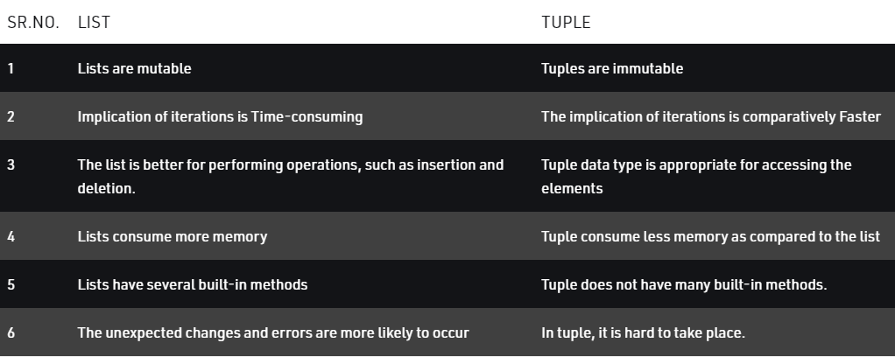

# Module 2 Python Data Structures
Data types are the classification or categorization of data items. Python supports the following built-in data types.

## Scalar Types

### int
Positive or negative numbers without a fractional part e.g. -2, 3, -158

### float
Real number with a floating-point representation in which a fractional component is denoted by a decimal symbol or scientific notation e.g. 1.54, 3.5668877e2

### complex
Number with a real and imaginary component represented as x + 2y e.g. 5+2j

### bool
Data with one of two built-in values 'True' or 'False'

### None
The None represents the 'null' object in Python


## Sequence Type

### String
A string value is a collection of one or more characters put in single, double or triple quotes.

### List
A list object is an ordered collection of one or more data items, not necessarily of the same type, put in square brackets.

### Tuple
A Tuple object is an ordered collection of one or more data items, not necessarily of the same type, put in parentheses.

### list vs tuple
[source](https://www.geeksforgeeks.org/python-difference-between-list-and-tuple/)


## Mapping Type

### Dictionarie
A dictionary Dict() object is an unordered collection of data in a key:value pair form. A collection of such pairs is enclosed in curly brackets.

### Set
Set is mutable, unordered collection of distinct hashable objects. The set is a Python implementation of the set in Mathematics. A set object has suitable methods to perform mathematical set operations like union, intersection, difference, etc.

### Counter
A Counter is a dict subclass for counting hashable objects

## Operation 

### Arithmetic Operators

* \+	Addition: adds two operands	x + y
* –	Subtraction: subtracts two operands	x – y
* \*	Multiplication: multiplies two operands	x * y
* \/	Division (float): divides the first operand by the second	x / y
* \//	Division (floor): divides the first operand by the second	x // y
* \%	Modulus: returns the remainder when first operand is divided by the second	x % y
* \**	Power : Returns first raised to power second	x ** y

### Assignment Operators

	Example	Same As	
* = Operator :	Example x = 5 , Same As x = 5
* += Operator : Example	x += 3 , Same As	x = x + 3	
* -= Operator :	Example x -= 3 , Same As	x = x - 3	
* *= Operator :	Example	x *= 3 , Same As 	x = x * 3
*  /= Operator :	Example	x /= 3 , Same As 	x = x / 3	
*  %= Operator :	Example	x %= 3 , Same As 	x = x % 3	
*  //= Operator :	Example	x //= 3 , Same As 	x = x // 3	
*  **= Operator :	Example	x **= 3 , Same As 	x = x ** 3	
*  &= Operator :	Example	x &= 3 , Same As 	x = x & 3	
*  |= Operator :	Example	x |= 3 , Same As 	x = x | 3
*  ^= Operator :	Example	x ^= 3 , Same As 	x = x ^ 3
*  \>>= Operator :	Example	x >>= 3 , Same As 	x = x >> 3	
*  <<= Operator :	Example	x <<= 3 , Same As 	x = x << 3


### Comparison Operators

* ==	Equal	x == y	
* !=	Not equal	x != y	
* \>	Greater than	x > y	
* <	Less than	x < y	
* \>=	Greater than or equal to	x >= y	
* <=	Less than or equal to	x <= y

### Logical Operators

* [and] Operator: 	Returns True if both statements are true	(x < 5 and  x < 10)	
* [or] Operator:	Returns True if one of the statements is true	(x < 5 or x < 4)	
* [not] Operator:	Reverse the result, returns False if the result is true	not(x < 5 and x < 10)

### Identity Operators
* [is] Operator: 	Returns True if both variables are the same object	(x is y)	
* [is not] Operator:	Returns True if both variables are not the same object	(x is not y)

### Membership Operators

* [in] Operator: 	Returns True if a sequence with the specified value is present in the object	(x in y)	
* [not in] Operator:	Returns True if a sequence with the specified value is not present in the object	(x not in y)

## Condition if else

``` python

#sample
if 1 == 1:
    print("1 = 1 ")

# nested if

if 1 < 2:
    elif 2 < 3:
        print('true')
    else:
        print('false')

```


## Usefull buildin Function

``` python

#split () string.split(separator, maxsplit) Split a string into a list where each word is a list item.

lst = "hello word".split(' ')
print(lst)

# >>> ['hello', 'word']

'hello+word'.split('+')

# >>> ['hello', 'word']

```

## Exercises

1) write a python program to calcule like calculator :
example (input 3+15) (output 18)
operations (+ * - / )