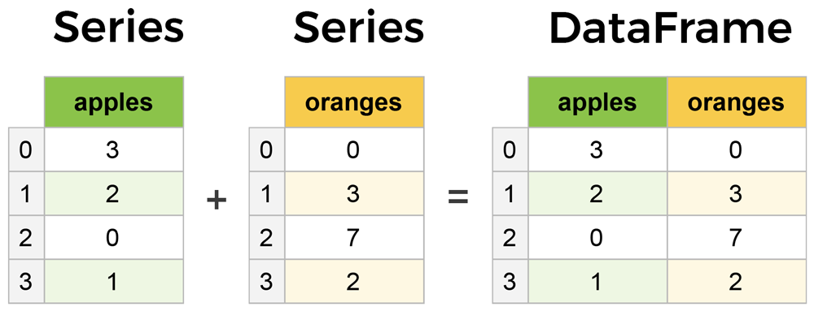

# Module 6 Working with data (pandas)

Pandas is a software library written for the Python programming language for data manipulation and analysis. In particular, it offers data structures and operations for manipulating numerical tables and time series.

## install Pandas

To install Pandas, we strongly recommend using a scientific Python distribution like (anaconda).

### with pip 

``` bash
pip install pandas
```

### with anaconda

``` bash
conda install pandas
```

## use Pandas

To access Pandas and its functions import it in your Python code like this:

``` python
import pandas as pd
```

We shorten the imported name to pd for better readability of code using Pandas like numpy.

## Pandas basic

The primary two components of pandas are the Series and DataFrame.

A Series is essentially a column, and a DataFrame is a multi-dimensional table made up of a collection of Series.



DataFrames and Series are quite similar in that many operations that you can do with one you can do with the other, such as filling in null values and calculating the mean.

### Pandas Series

Pandas Series is One-dimensional ndarray with axis labels (including time series).

``` python
pandas.Series(data=None, index=None, dtype=None, name=None, copy=False)
```

### Parameters
* data : [ array-like, Iterable, dict, or scalar value ]
Contains data stored in Series. If data is a dict, argument order is maintained.

* index : [ array-like or Index (1d) ]
Values must be hashable and have the same length as data. Non-unique index values are allowed. Will default to RangeIndex (0, 1, 2, …, n) if not provided. If data is dict-like and index is None, then the keys in the data are used as the index. If the index is not None, the resulting Series is reindexed with the index values.

* dtype : [ str, numpy.dtype, or ExtensionDtype ], optional
Data type for the output Series. If not specified, this will be inferred from data. See the user guide for more usages.

* name [ str ], optional
The name to give to the Series.

* copy [ bool ], default False
Copy input data. Only affects Series or 1d ndarray input. See examples.

``` python

# import numpy and pandas

import pandas as pd
import numpy as np


# create series from dictionary
d = {'a' : 0 , 'b' : 1 , 'c' : 3 , 'd' : 4}
s = pd.Series(data = d , index = ['a','b','c','d'])
print(s)

"""
a    0
b    1
c    3
d    4
dtype: int64
"""

# the keys of the dict match with the index values, hence the index values have no effect

s1 = pd.Series(data = d , index = ['y','z','v','w'])
print(s1)

"""
y   NaN
z   NaN
v   NaN
w   NaN
dtype: float64
"""
d1 = np.arange(6)
s2 = pd.Series(data=d1, index=['a', 'b', 'c', 'd', 'e', 'f'])
print(s2)

"""
a    0
b    1
c    2
d    3
e    4
f    5
dtype: int32
"""

# head and tail to view small sample of a Series, The default number of elements to display is five, but you may pass a custom number

#
s2.head(2)

"""
a    0
b    1
dtype: int32
"""

s2.tail(2)

"""
e    4
f    5
dtype: int32
"""
```


### Pandas Dataframe

There are many ways to create a DataFrame from scratch, but a great option is to just use a simple dict.


``` python
import pandas as pd
import numpy as np

data = {
    'Matier' : ['SAS','BigData','BA'],
    'Score' : [10.2 , 11.0 , 12.5]
}

df = pd.DataFrame(data)

"""
    Matier	Score
0	SAS	    10.2
1	BigData	11.0
2	BA	    12.5
"""

# The Index of this DataFrame was given to us on creation as the numbers 0-2, but we could also create our own when we initialize the DataFrame.

df = pd.DataFrame(data,index=['code_sas','code_bigdata','code_ba'])

"""
	            Matier	Score
code_sas	    SAS	    10.2
code_bigdata    BigData	11.0
code_ba	        BA	    12.5
"""

# Locate data by using the index (code)

sas = df.loc['code_sas']

"""
Matier     SAS
Score     10.2
Name: code_sas, dtype: object
"""

# create dataframe from series

d1 = np.arange(6)
d2 = np.arange(6,6)

index = ['a', 'b', 'c', 'd', 'e', 'f']
s1 = pd.Series(data=d1, index= index)
s2 = pd.Series(data=d1, index=index)

df = pd.DataFrame([s1,s2])

"""
    a	b	c	d	e	f
0	0	1	2	3	4	5
1	6	7	8	9	10	11
"""

df.index = ['MA','ME']

"""
	a	b	c	d	e	f
MA	0	1	2	3	4	5
ME	6	7	8	9	10	11
"""

```

## Preprocessing with Pandas

### dataset
We use Dataset from this link 
https://archive.ics.uci.edu/ml/datasets/Adult

With CSV files all you need is a single line to load in the data

``` python
df = pd.read_csv('../datasets/adult/adult.data')

df.head(5)

# if your data without labels you must init header to None
# columns from dataset/adult/adult.names
columns = ['age',
         'workclass',
         'fnlwgt',
         'education',
         'education-num',
         'marital-status',
         'occupation',
         'relationship',
         'race',
         'sex',
         'capital-gain',
         'capital-loss',
         'hours-per-week',
         'native-country',
         'result']

df = pd.read_csv('../datasets/adult/adult.data', header=None)
df.head(5)

df.columns = columns
df.head(5)


# get info from dataframe with info()

df.info()

"""
<class 'pandas.core.frame.DataFrame'>
RangeIndex: 32561 entries, 0 to 32560
Data columns (total 15 columns):
 #   Column          Non-Null Count  Dtype 
---  ------          --------------  ----- 
 0   age             32561 non-null  int64 
 1   workclass       32561 non-null  object
 2   fnlwgt          32561 non-null  int64 
 3   education       32561 non-null  object
 4   education-num   32561 non-null  int64 
 5   marital-status  32561 non-null  object
 6   occupation      32561 non-null  object
 7   relationship    32561 non-null  object
 8   race            32561 non-null  object
 9   sex             32561 non-null  object
 10  capital-gain    32561 non-null  int64 
 11  capital-loss    32561 non-null  int64 
 12  hours-per-week  32561 non-null  int64 
 13  native-country  32561 non-null  object
 14  result          32561 non-null  object
dtypes: int64(6), object(9)
memory usage: 3.7+ MB
"""

# get more info for numeric columns with describe()

df.describe()
"""
        age	        fnlwgt	education-num	capital-gain	capital-loss	hours-per-week
count	32561.0	    3.256100e+04	32561.0	    32561.0	    32561.0	    32561.0
mean	38.581647	1.897784e+05	10.080679	1077.648844	87.303830	40.437456
std	    13.640433	1.055500e+05	2.572720	7385.292085	402.960219	12.347429
min	    17.000000	1.228500e+04	1.000000	0.000000	0.000000	1.000000
25%	    28.000000	1.178270e+05	9.000000	0.000000	0.000000	40.000000
50%	    37.000000	1.783560e+05	10.000000	0.000000	0.000000	40.000000
75%	    48.000000	2.370510e+05	12.000000	0.000000	0.000000	45.000000
max	    90.000000	1.484705e+06	16.000000	99999.0	    4356.0	    99.0
"""
```
### Duplicated lines

detect duplicated lines with

```python
df.duplicated().sum()
# 211
```

drop duplicated lines with 


```python
df = df.drop_duplicates()
df.duplicated().sum()
# 0
```
### Null values

detect null value with

```python
df.isnull().sum()
#or df.isna().sum()

"""
age                  0
workclass         1836
fnlwgt               0
education            0
education-num        0
marital-status       0
occupation        1843
relationship         0
race                 0
sex                  0
capital-gain         0
capital-loss         0
hours-per-week       0
native-country     582
result               0
dtype: int64
"""
```

print lines with null value with

```python
null_data = df[df.isna().any(axis=1)]
print(null_data)
print(null_data.shape)
# 0
```

Data Scientists and Analysts regularly face the dilemma of dropping or imputing null values, and is a decision that requires intimate knowledge of your data and its context. Overall, removing null data is only suggested if you have a small amount of missing data.

drop null value with 

``` python
df = df.dropna()
```
test if exist lines with null value

``` python
df.isna().sum()
"""
age               0
workclass         0
fnlwgt            0
education         0
education-num     0
marital-status    0
occupation        0
relationship      0
race              0
sex               0
capital-gain      0
capital-loss      0
hours-per-week    0
native-country    0
result            0
dtype: int64
"""
```

### Imputation

Imputation is a conventional feature engineering technique used to keep valuable data that have null values.

There may be instances where dropping every row with a null value removes too big a chunk from your dataset, so instead we can impute that null with another value, usually the mean or the median of that column.

We gonna use scikit-learn for imputation process

First install scikit-learn with

``` bash
pip install scikit-learn
conda install scikit-learn 
```

One type of imputation algorithm is univariate, which imputes values in the i-th feature dimension using only non-missing values in that feature dimension (e.g. impute.SimpleImputer). By contrast, multivariate imputation algorithms use the entire set of available feature dimensions to estimate the missing values (e.g. impute.IterativeImputer).

#### Univariate feature imputation


The SimpleImputer class provides basic strategies for imputing missing values. Missing values can be imputed with a provided constant value, or using the statistics (mean, median or most frequent) of each column in which the missing values are located. This class also allows for different missing values encodings.

``` python
import numpy as np
import pandas as pd
from sklearn.impute import SimpleImputer

columns = ['age', 'fnlwgt', 'education-num', 'capital-gain', 'capital-loss']
data = df[columns]

imputation = SimpleImputer(missing_values=np.nan, strategy='mean')
clean_data = imputation.fit_transform(data)
clean_data = pd.DataFrame(clean_data,columns=columns)

print(clean_data.isnull().sum())

```

The SimpleImputer class also supports categorical data represented as string values or pandas categoricals when using the 'most_frequent' or 'constant' strategy


``` python
import numpy as np
import pandas as pd
from sklearn.impute import SimpleImputer

columns = ['workclass',
         'education',
         'marital-status',
         'occupation',
         'relationship',
         'race',
         'sex',
         'native-country',
         'result']
data = df[columns]

print(data.isnull().sum())

imputation = SimpleImputer(strategy='most_frequent')
clean_data = imputation.fit_transform(data)
clean_data = pd.DataFrame(clean_data,columns=columns)

print(clean_data.isnull().sum())

```

#### Multivariate feature imputation

A more sophisticated approach is to use the IterativeImputer class, which models each feature with missing values as a function of other features, and uses that estimate for imputation. It does so in an iterated round-robin fashion: at each step, a feature column is designated as output y and the other feature columns are treated as inputs X. A regressor is fit on (X, y) for known y. Then, the regressor is used to predict the missing values of y. This is done for each feature in an iterative fashion, and then is repeated for max_iter imputation rounds. The results of the final imputation round are returned.

``` python
from sklearn.experimental import enable_iterative_imputer
from sklearn.impute import IterativeImputer

columns = ['age', 'fnlwgt', 'education-num', 'capital-gain', 'capital-loss']
data = df[columns]

print(data.isnull().sum())

imputation = IterativeImputer(max_iter=10, random_state=0)
clean_data = np.round(imputation.fit_transform(data))
clean_data = pd.DataFrame(clean_data,columns=columns)

print(clean_data.isnull().sum())

```
#### Multiple vs. Single Imputation
In the statistics community, it is common practice to perform multiple imputations, generating, for example, m separate imputations for a single feature matrix. Each of these m imputations is then put through the subsequent analysis pipeline (e.g. feature engineering, clustering, regression, classification). The m final analysis results (e.g. held-out validation errors) allow the data scientist to obtain understanding of how analytic results may differ as a consequence of the inherent uncertainty caused by the missing values. The above practice is called multiple imputation.

#### Nearest neighbors imputation

The KNNImputer class provides imputation for filling in missing values using the k-Nearest Neighbors approach. By default, a euclidean distance metric that supports missing values, nan_euclidean_distances, is used to find the nearest neighbors. Each missing feature is imputed using values from n_neighbors nearest neighbors that have a value for the feature. The feature of the neighbors are averaged uniformly or weighted by distance to each neighbor. If a sample has more than one feature missing, then the neighbors for that sample can be different depending on the particular feature being imputed. When the number of available neighbors is less than n_neighbors and there are no defined distances to the training set, the training set average for that feature is used during imputation. If there is at least one neighbor with a defined distance, the weighted or unweighted average of the remaining neighbors will be used during imputation. If a feature is always missing in training, it is removed during transform. For more information on the methodology

``` python
from sklearn.impute import KNNImputer

columns = ['age', 'fnlwgt', 'education-num', 'capital-gain', 'capital-loss']
data = df[columns]

print(data.isnull().sum())

imputation = KNNImputer(n_neighbors=2, weights="uniform")
clean_data = imputation.fit_transform(data)
clean_data = pd.DataFrame(clean_data,columns=columns)

print(clean_data.isnull().sum())

```

## Understanding your variables
Using describe() on an entire DataFrame we can get a summary of the distribution of continuous variables

``` python
df.describe()
```

.describe() can also be used on a categorical variable to get the count of rows, unique count of categories, top category, and freq of top category

``` python
df.workclass.describe()
```

.value_counts() can tell us the frequency of all values in a column

``` python
df.relationship.value_counts()
```
By using the correlation method .corr() we can generate the relationship between each continuous variable

``` python
df.corr()
```

Correlation tables are a numerical representation of the bivariate relationships in the dataset.

Positive numbers indicate a positive correlation — one goes up the other goes up — and negative numbers represent an inverse correlation — one goes up the other goes down. 1.0 indicates a perfect correlation.

## DataFrame slicing, selecting, extracting

It's important to note that, although many methods are the same, DataFrames and Series have different attributes, so you'll need be sure to know which type you are working with or else you will receive attribute errors.

### By Column

to get column 

``` python
col = df.age
#or
col = df['age']
```